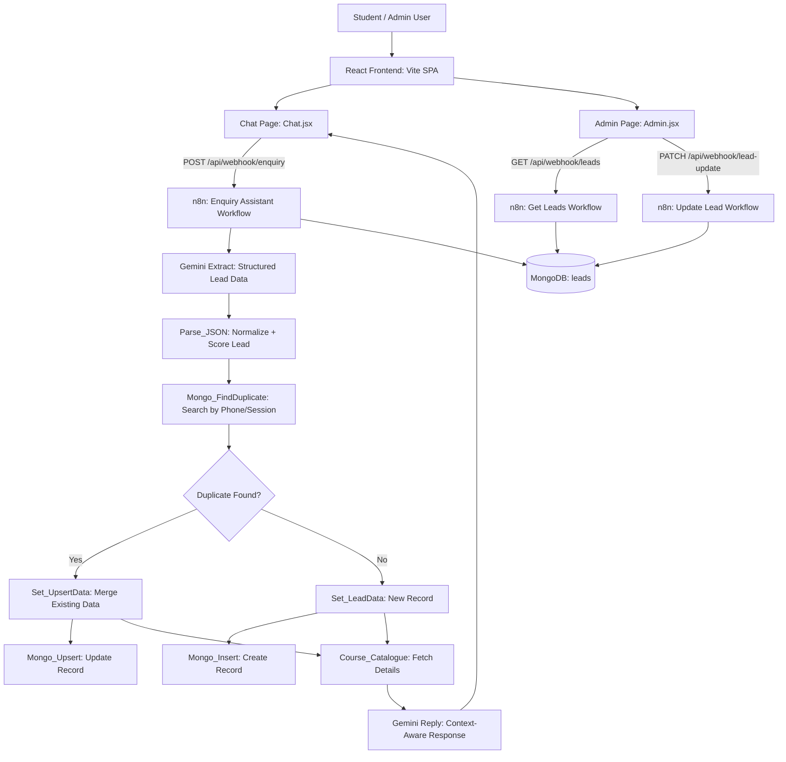

# 🤖 EduReach AI Enquiry Assistant

An AI-powered course enquiry assistant built with **React/Vite** and **n8n**. Students can chat with the assistant to ask about courses, while admins can view, prioritize, and update leads through a lightweight admin dashboard.

---

## ✨ Features

| Feature | Description |
|---|---|
| 💬 **Chat Interface** | WhatsApp-style React chat UI for student enquiries |
| 🆘 **.help Command** | Quick local command to show available courses and instructions |
| 🧠 **AI Extraction** | Uses Gemini to extract name, phone, course interest, intent, urgency, and confidence |
| 📚 **Course Catalogue** | n8n workflow maps detected course interest to structured course details |
| 🗂️ **Lead Admin Panel** | React admin page lists leads with priority, status, timestamps, and actions |
| 🔁 **Returning User Memory** | AI remembers name/interest from previous sessions using `session_id` or `phone` |
| 📊 **Priority Scoring** | Scores leads based on phone, course interest, confidence, urgency, and intent |
| 🛠️ **Status Updates** | Admins can mark leads as new, contacted, follow-up due, manual review, or closed |
| 🗄️ **MongoDB Storage** | n8n persists leads in the `leads` collection |

---

## 🚀 Quick Start (Local)

### 1. Environment Setup
```bash
# Copy the env template and fill in your n8n instance URL
cp enquiry-frontend/.env.example enquiry-frontend/.env
# Edit enquiry-frontend/.env and set VITE_N8N_BASE_URL
```

### 2. Frontend Setup
```bash
cd enquiry-frontend
npm install
npm run dev
```

The React app runs through Vite. The dev proxy forwards `/api/*` requests to the n8n Cloud instance URL configured in your `.env` file.

### 3. n8n Workflow Setup
```text
Import these workflow template files into n8n:

n8n-Workflows/json-templates/Enquiry Assistant.json
n8n-Workflows/json-templates/Get Leads.json
n8n-Workflows/json-templates/Update Lead.json
n8n-Workflows/json-templates/Delete Lead.json
```

After importing, replace the `YOUR_GEMINI_API_KEY` and `YOUR_MONGO_CREDENTIAL_ID` placeholders with your actual credentials inside n8n, then activate the workflows.

---

## 🏗️ Architecture

The application is split into a React frontend and n8n automation backend. React sends chat and admin requests to n8n webhooks. n8n handles AI extraction, lead persistence, duplicate handling, reply generation, and admin updates.



### Key Workflows:
- **Enquiry Assistant**: Receives student messages, extracts lead data with Gemini, scores priority, stores or updates MongoDB records, and returns a friendly course reply.
- **Get Leads**: Fetches up to 100 leads from MongoDB sorted by highest priority score.
- **Update Lead**: Updates a lead status using the phone number as the update key.

---

## ⚙️ Configuration

### Frontend
The frontend proxy is configured in `enquiry-frontend/vite.config.js` and reads from `enquiry-frontend/.env`:

```env
VITE_N8N_BASE_URL=https://<your-n8n-instance>.app.n8n.cloud
```

Proxy behavior (all resolved at dev time):

```text
/api/webhook/enquiry      -> <VITE_N8N_BASE_URL>/webhook/enquiry
/api/webhook/leads        -> <VITE_N8N_BASE_URL>/webhook/leads
/api/webhook/lead-update  -> <VITE_N8N_BASE_URL>/webhook/lead-update
/api/webhook/lead-delete  -> <VITE_N8N_BASE_URL>/webhook/lead-delete
```

### n8n
Configure these credentials inside n8n's Credentials UI:

- **MongoDB**: Connection string for the `leads` collection
- **Gemini API Key**: Used in the Enquiry Assistant workflow HTTP Request nodes

> ⚠️ All secrets are stored in n8n credentials or `.env` files — never committed to Git.

---

## 🧾 Lead Data Model

The `leads` collection stores records shaped around these fields:

| Field | Purpose |
|---|---|
| `name` | Student name extracted from the message |
| `phone` | Phone number used as the duplicate/update key |
| `course_interest` | Detected course category |
| `intent` | Enquiry intent such as new enquiry, follow-up, complaint, or general |
| `summary` | One-line AI-generated summary |
| `extraction_confidence` | AI confidence: high, medium, or low |
| `priority_score` | Numeric lead score used for admin sorting |
| `raw_message` | Original student message |
| `status` | Lead status shown in the admin panel |
| `created_at` | First-created timestamp |
| `last_contacted_at` | Latest interaction timestamp |
| `interaction_count` | Initial interaction counter for new leads |

---

## 🤖 Models Used

- **Extraction LLM**: `gemini-2.5-flash`
- **Reply LLM**: `gemini-2.5-flash`
- **Frontend Runtime**: React 19 + Vite
- **Automation Runtime**: n8n Cloud
- **Database**: MongoDB `leads` collection

---

## 📁 Project Structure

```text
.
├── enquiry-frontend/
│   ├── .env.example          # ← copy to .env, set your n8n URL
│   ├── src/
│   │   ├── App.jsx
│   │   ├── main.jsx
│   │   ├── components/
│   │   │   ├── LeadRow.jsx
│   │   │   └── MessageBubble.jsx
│   │   └── pages/
│   │       ├── Admin.jsx
│   │       └── Chat.jsx
│   ├── package.json
│   └── vite.config.js
├── n8n-Workflows/
│   ├── json-templates/       # ← sanitized workflows (committed)
│   │   ├── Enquiry Assistant.json
│   │   ├── Get Leads.json
│   │   ├── Delete Lead.json
│   │   └── Update Lead.json
│   ├── json/                 # ← real exports (gitignored)
│   └── Screenshots/
├── .env.example
├── ARCHITECTURE.drawio
└── README.md
```

---

## 🛡️ License

MIT License - Built for education, lead management, and automated student enquiry handling.